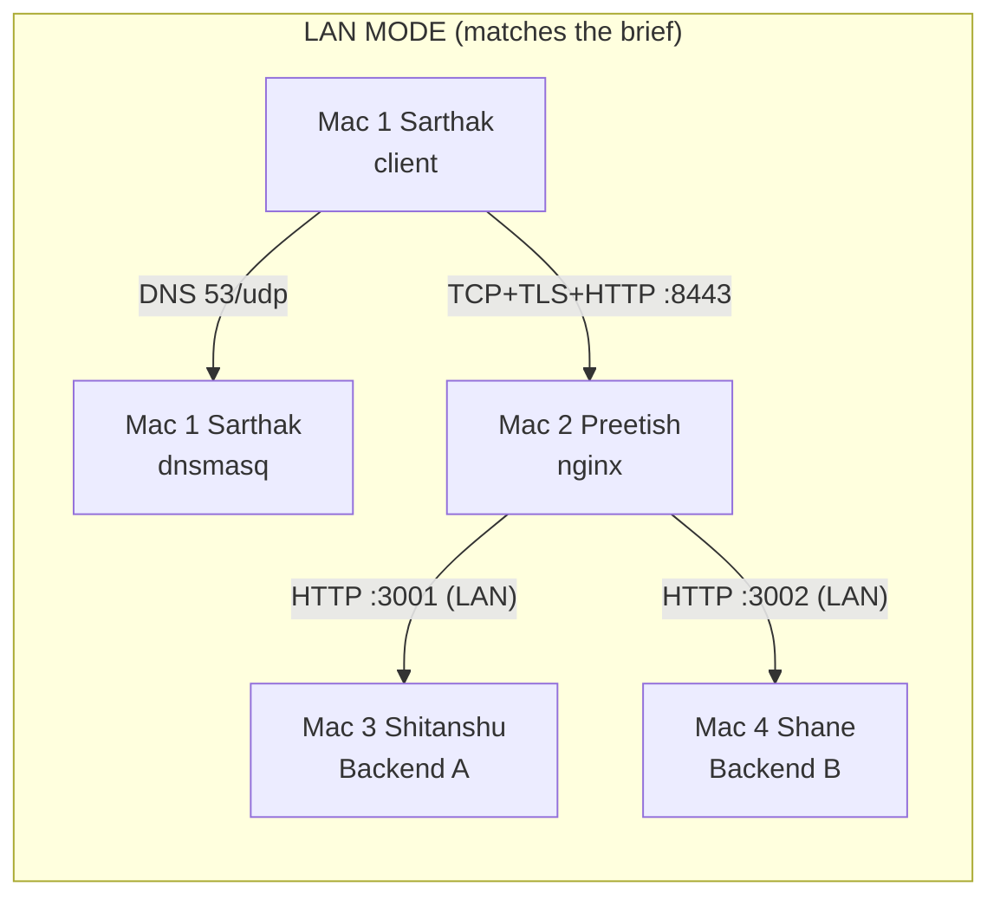
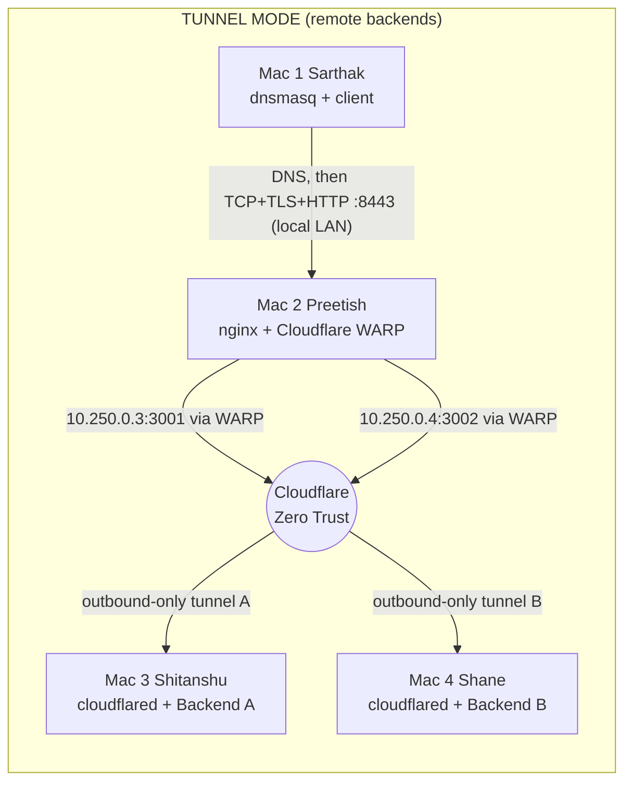

# CN Private Network Service Platform - Phase 1

**What this does.** A client types `https://app.team1.test:8443`. Our own DNS server (dnsmasq) turns that
name into the edge Mac's IP, the client opens a TCP connection and a TLS session to nginx, and nginx
forwards the HTTP request - alternating - to Backend A or Backend B. Every step can be observed with
`dig`, `curl -v`, and Wireshark. *The application stays simple; the network is the project.*

| Mac | Person | Role | Ports |
|---|---|---|---|
| 1 | **Sarthak** | Private DNS (dnsmasq) + controller + test client | 53/udp+tcp |
| 2 | **Preetish** | nginx edge: TLS termination, reverse proxy, round-robin LB | 8443/tcp |
| 3 | **Shitanshu** | Backend A (Python stdlib REST) | 3001/tcp |
| 4 | **Shane** | Backend B (same code, different config) | 3002/tcp |

> **Team Setup Runbook:** See [docs/TEAM_SETUP.md](docs/TEAM_SETUP.md) for full step-by-step instructions for each teammate.

## Two network modes (`NETWORK_MODE`)

* **`lan`** - the architecture from the university brief. All four Macs share one private Wi-Fi/LAN and talk directly. **This is the mode to submit and demo unless faculty approves otherwise.**
* **`tunnel`** - for when Shitanshu/Shane are physically remote. Only the *nginx -> backend* hop changes: it travels over a Cloudflare Zero Trust private network. Sarthak <-> Preetish (DNS, TCP, TLS, HTTP) stay on the local LAN, so those layers remain observable.

> Tunnel mode is **not** equivalent to a four-Mac LAN (the brief requires a shared LAN, LAN inventory and pairwise pings, and a locally-run system). It exists for remote development/demo. Nothing in the application, nginx or DNS code changes between modes - only the upstream addresses.





More diagrams: [docs/diagrams.md](docs/diagrams.md). Request walk-through: [docs/REQUEST_FLOW.md](docs/REQUEST_FLOW.md).

## Quick start - one command per Mac

Everyone: `git clone https://github.com/mishrasarthak08/cn_project_PS3.git && cd cn_project_PS3`. Run **in this order** (Preetish creates the CA others need):

| Order | Who | Command |
|---|---|---|
| 1 | Shitanshu | `./macs/mac3-shitanshu/setup.sh` |
| 1 | Shane | `./macs/mac4-shane/setup.sh` |
| 2 | Preetish | `./macs/mac2-preetish/setup.sh` then `git add pki/ca.crt && git commit -m "Add public CA cert" && git push` |
| 3 | Sarthak | `git pull && ./macs/mac1-sarthak/setup.sh` |
| 4 | any other client | `git pull && scripts/configure-client-dns.sh` |

Setup scripts ask once for non-secret values (team name, mode, LAN IPs) and remember them in
`~/.config/cn-phase1/project.env` (chmod 600). They are **idempotent** - run them again any time.
Tunnel mode additionally needs the one-time admin step: [docs/CLOUDFLARE_MODE.md](docs/CLOUDFLARE_MODE.md).

## Daily commands (any Mac, after setup)

```bash
./bin/start | stop | status      # this Mac's role + whole-system view (real requests, not pgrep)
./bin/test-all                   # layered PASS/FAIL, non-zero exit on failure
./bin/doctor                     # first failing layer + concept + commands to investigate
./bin/collect-evidence           # timestamped evidence/<time>/ (no secrets)
./bin/failure-demo <scenario> <break|rollback|explain>
./bin/teardown                   # stop services, remove scoped resolver
scripts/capture-packets.sh 60    # bounded tcpdump for Wireshark (Task G)
```

## Repo map

```
backends/server.py      one stdlib-only REST backend (A or B by env)
config/                 project.example.env (all constants), dnsmasq + nginx templates
scripts/                common.sh, roles.sh, role.sh, checks.sh, CA/DNS/capture helpers
macs/mac{1..4}-*/       setup|start|stop|status.sh + README per machine
bin/                    operator commands       tests/   per-layer tests
admin/                  one-time Cloudflare bootstrap (Sarthak only)
docs/                   architecture, flow, viva, failures, troubleshooting, team setup
pki/ca.crt              PUBLIC CA certificate (generated by Preetish, safe to commit)
evidence/               screenshots / pcaps / collected outputs
```

## Where things live (never in git)

`~/.config/cn-phase1/` - saved settings, generated configs, `tls/` (CA + server private keys), `secrets/` (tunnel credentials), backups.
`~/Library/Logs/cn-phase1/` - dnsmasq, nginx access/error, backend, cloudflared logs.

## Security rules

Never commit tokens, credentials JSON, `.env`, or any private key (`.gitignore` blocks them). The CA *private* key never leaves the edge Mac; clients receive only `pki/ca.crt`. Scripts back up any file before touching it (`~/.config/cn-phase1/backups/INDEX`) and never use `curl -k`.

## Docs

[AI AGENT PROMPTS](docs/AI_AGENT_PROMPTS.md) - [TEAM SETUP GUIDE](docs/TEAM_SETUP.md) - [VIDEO SCRIPT (SHITANSHU)](docs/SHITANSHU_VIDEO_SCRIPT.md) - [FORM & EVALUATION GUIDE (PREETISH)](docs/PREETISH_FORM_AND_SYSTEM_GUIDE.md) - [REPORT_TEMPLATE](docs/REPORT_TEMPLATE.md) - [ARCHITECTURE](docs/ARCHITECTURE.md) - [REQUEST_FLOW](docs/REQUEST_FLOW.md) - [PHASE1](docs/PHASE1.md) (task-by-task checklist) - [LAN_MODE](docs/LAN_MODE.md) - [CLOUDFLARE_MODE](docs/CLOUDFLARE_MODE.md) - [FAILURE_DEMOS](docs/FAILURE_DEMOS.md) - [TROUBLESHOOTING](docs/TROUBLESHOOTING.md) - [VIVA](docs/VIVA.md)


---
*Forked and configured for Sarthak Mishra (`mishrasarthak08`), Preetish Ubhrani (`ubhranipreetish`), Shitanshu Tiwari, and Shane.*
