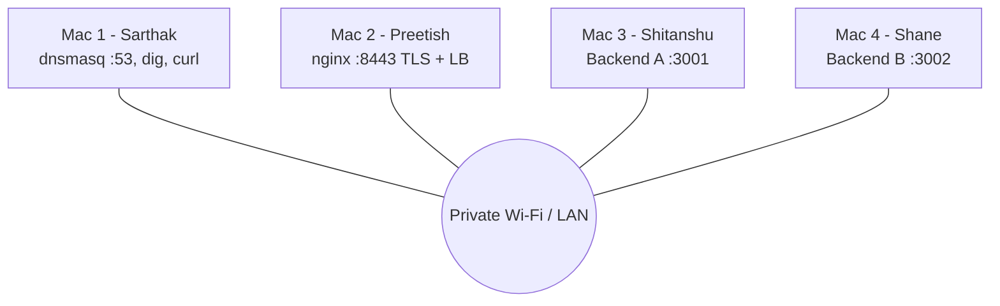
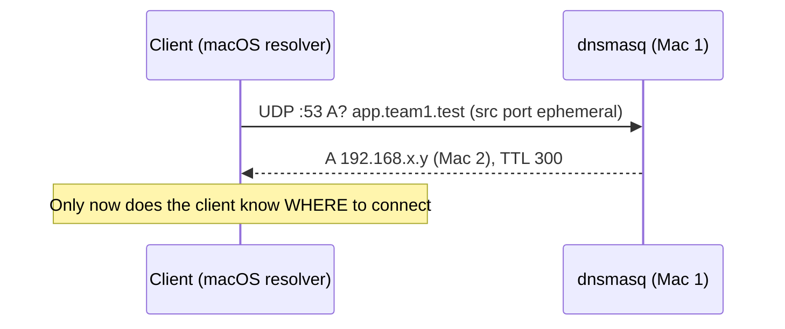
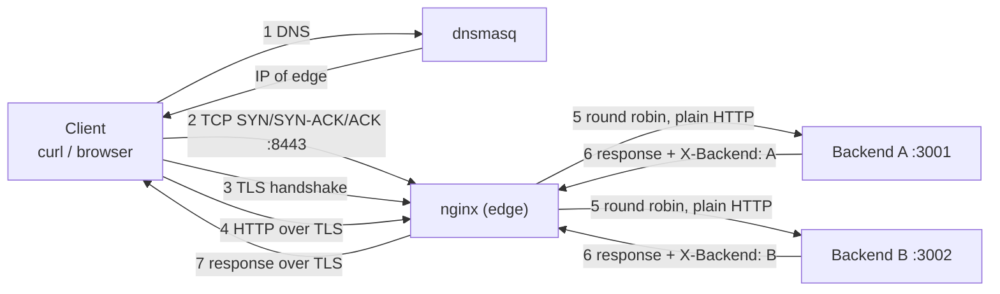
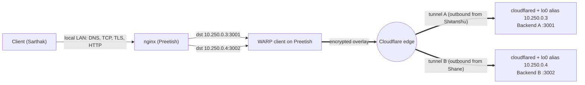
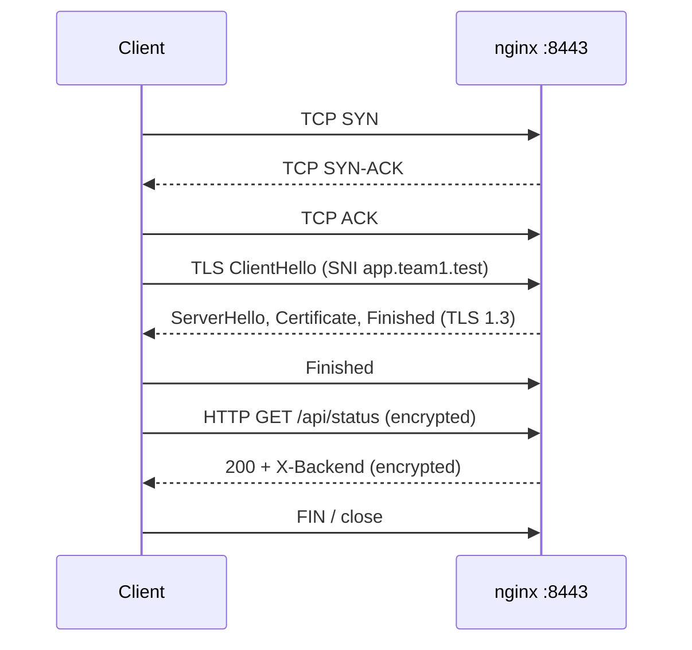
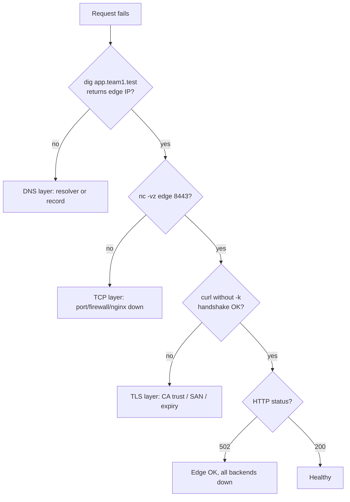

# Diagrams (Mermaid)

## 1. Machine topology (LAN mode)

```mermaid
flowchart TB
  LAN(("Private Wi-Fi / LAN"))
  M1["Mac 1 - Sarthak<br/>dnsmasq :53, dig, curl"] --- LAN
  M2["Mac 2 - Preetish<br/>nginx :8443 TLS + LB"] --- LAN
  M3["Mac 3 - Shitanshu<br/>Backend A :3001"] --- LAN
  M4["Mac 4 - Shane<br/>Backend B :3002"] --- LAN
```

## 2. DNS request

```mermaid
sequenceDiagram
  participant Cl as Client (macOS resolver)
  participant D as dnsmasq (Mac 1)
  Cl->>D: UDP :53 A? app.team1.test (src port ephemeral)
  D-->>Cl: A 192.168.x.y (Mac 2), TTL 300
  Note over Cl: Only now does the client know WHERE to connect
```

## 3. Full HTTP request path

```mermaid
flowchart LR
  B["Client<br/>curl / browser"] -->|"1 DNS"| D["dnsmasq"]
  D -->|"IP of edge"| B
  B -->|"2 TCP SYN/SYN-ACK/ACK :8443"| N["nginx (edge)"]
  B -->|"3 TLS handshake"| N
  B -->|"4 HTTP over TLS"| N
  N -->|"5 round robin, plain HTTP"| BA["Backend A :3001"]
  N -->|"5 round robin, plain HTTP"| BB["Backend B :3002"]
  BA -->|"6 response + X-Backend: A"| N
  BB -->|"6 response + X-Backend: B"| N
  N -->|"7 response over TLS"| B
```

## 4. Tunnel-mode path

```mermaid
flowchart LR
  C["Client (Sarthak)"] -->|"local LAN: DNS, TCP, TLS, HTTP"| E["nginx (Preetish)"]
  E -->|"dst 10.250.0.3:3001"| W["WARP client on Preetish"]
  E -->|"dst 10.250.0.4:3002"| W
  W ==>|"encrypted overlay"| CF(("Cloudflare edge"))
  CF ==>|"tunnel A (outbound from Shitanshu)"| HA["cloudflared + lo0 alias 10.250.0.3<br/>Backend A :3001"]
  CF ==>|"tunnel B (outbound from Shane)"| HB["cloudflared + lo0 alias 10.250.0.4<br/>Backend B :3002"]
```

## 5. TCP / TLS / HTTP sequence

```mermaid
sequenceDiagram
  participant C as Client
  participant N as nginx :8443
  C->>N: TCP SYN
  N-->>C: TCP SYN-ACK
  C->>N: TCP ACK
  C->>N: TLS ClientHello (SNI app.team1.test)
  N-->>C: ServerHello, Certificate, Finished (TLS 1.3)
  C->>N: Finished
  C->>N: HTTP GET /api/status (encrypted)
  N-->>C: 200 + X-Backend (encrypted)
  C->>N: FIN / close
```

## 6. Failure isolation

```mermaid
flowchart TD
  S["Request fails"] --> Q1{"dig app.team1.test<br/>returns edge IP?"}
  Q1 -- no --> DNS["DNS layer: resolver or record"]
  Q1 -- yes --> Q2{"nc -vz edge 8443?"}
  Q2 -- no --> TCP["TCP layer: port/firewall/nginx down"]
  Q2 -- yes --> Q3{"curl without -k<br/>handshake OK?"}
  Q3 -- no --> TLS["TLS layer: CA trust / SAN / expiry"]
  Q3 -- yes --> Q4{"HTTP status?"}
  Q4 -- "502" --> BE["Edge OK, all backends down"]
  Q4 -- "200" --> OK["Healthy"]
```
